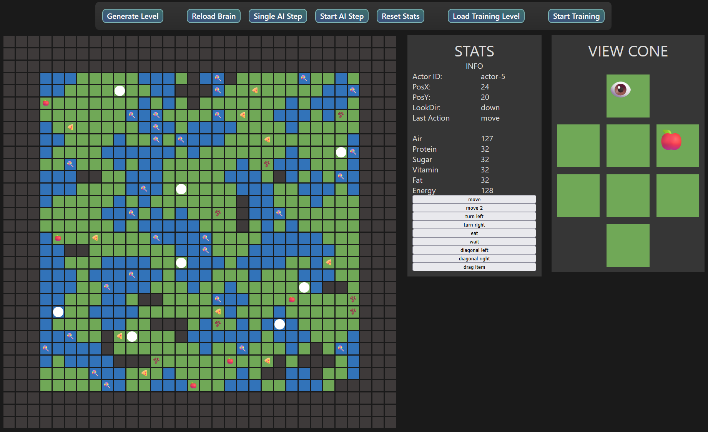

# DarWinWin

### Ecosystem Simulation with Genetic Algorithm

In this project AI-Actors were trained to survive in a procedurally generated Ecosystem. Using a **cutom-written Neural Network** with **Genetic Algortihm** (Scoring Function).

- Written in C++
- Neural Netwerk in SIMD (AVX2), 8-Bit Fixed Point
- Genetic Algorithm: Crossbreed & Mutate
- Mutation Parameter via Evolution (chance, rate)
- Multihreaded Training

The simulation includes procedurally generated levels (non-exclusiv: underwater, several food types, collidable) with the actors being able to move in any direaction, eat, wait or drag items whilst facing the threats of starvation and drowning.

Including a HTML/JS Web-Interface with Webserver via Crow for visualization:

<a></a>
<br>

### How to build the project:
```bat
create_project.bat
MSBuild /p:Configuration=Release /nologo /v:m
```

See Progress Report [here](https://github.com/tibifant/darwinwin/blob/main/progress.md).
